**“Mleaf”—告诉你叶子秘密的App**

植物在我们的生活中扮演着必不可少的角色，它给人类提供生存必需的营养物质，释放氧气，美化环境等等。但是截止到目前，当面对一种未知的植物，我们还是无法通过有效的方法去快速获得其信息。因此我们可以结合现有的信息技术，实现一个以基于植物叶片图像来辨识植物种类功能为主的，同时辅有植物培育技巧普及，植物随笔等功能的手机应用。

本论文主要介绍了“识叶”系统的实现过程：主要包括项目的研究现状、总体设计、以及各模块的详细设计，其主要包括：登录&&注册模块、“资讯”模块、“识叶”模块，关于我们模块，帮助模块。在本系统的开发中我们用到的开发工具主要有Android
studio、myeclipse、MySQL，用到的语言是Java。

**关键词：**Android；叶片识别

**ABSTRACT**

Plant plays a vital role in our life, and it provides necessary nutrition for
human beings, product oxygen, beautify the environment, etc. As for now, we
still cannot access the information when we facing an unknown plant by an
effective and fast way. So, we can realize a mobile phone application, by
combining nowadays’ technology, mainly target for recognizing species of plants
by images of plant leaves. And it also have features for propagating plant
breeding techniques, dairy of plants and so on.

In this paper, we introduce the realizing procedure of “Recognizing Leaves”.
Including the state-of-art of this project, general design, and detailed design.
The detailed design mainly incudes “Login and Sing up” module, “Information”
module, “Recognizing Leaves” module, “About us” module, and “Help” module. We
use Android Studio, myeclipse and MySQL in realizing this system, and we
implement the source code in Java.

**Keywords: Android, recognizing leaves.**

**目 录**
=========

[第一章 绪 论 1](#_Toc448095355)

[1.1 项目背景及意义 1](#_Toc448095356)

[1.2 主要研究内容 3](#_Toc448095357)

[1.2.1 国内外研究现状 3](#_Toc448095358)

[1.2.2 项目研究目标 3](#_Toc448095359)

[第二章 平台与开发工具 4](#_Toc448095360)

[2.1 android studio 简介 4](#_Toc448095361)

[2.2 SlidingMenu简介 4](#_Toc448095362)

[2.3 xUtils的简介 4](#_Toc448095363)

[第三章 系统的总体分析和设计 5](#_Toc448095364)

[3.1 系统概述 5](#_Toc448095365)

[3.2 系统的功能分析 5](#_Toc448095366)

[3.2.1系统登录&&注册模块 5](#_Toc448095367)

[3.2.2 “资讯”模块 6](#_Toc448095368)

[3.2.3 “识叶”模块 6](#_Toc448095369)

[3.2.4 关于我们模块 6](#_Toc448095370)

[3.2.5 帮助模块 6](#_Toc448095371)

[3.3 系统的总体设计 6](#_Toc448095372)

[第四章 系统的详细设计 10](#_Toc448095373)

[4.1 登陆&&注册模块设计 10](#_Toc448095374)

[4.1.1 客户端设计 10](#_Toc448095375)

[4.1.2 服务器设计 11](#_Toc448095376)

[4.1.3 数据库设计 12](#_Toc448095377)

[4.2 “资讯”模块设计 12](#_Toc448095378)

[4.2.1 客户端设计 12](#_Toc448095379)

[4.2.2 服务器设计 14](#_Toc448095380)

[4.2.3 数据库设计 14](#_Toc448095381)

[4.3 “识叶”模块设计 15](#_Toc448095382)

[4.3.1 客户端设计 15](#_Toc448095383)

[4.3.2 服务器设计 16](#_Toc448095384)

[4.3.2.1 图像预处理 17](#_Toc448095385)

[4.3.2.2 形状特征提取 18](#_Toc448095386)

[4.3.2.3 纹理特征提取 19](#_Toc448095387)

[4.3.2.3 颜色特征提取 19](#_Toc448095388)

[4.3.2.4 分类器设计 20](#_Toc448095389)

[4.4 帮助模块设计 20](#_Toc448095390)

[4.4.1 客户端设计 20](#_Toc448095391)

[4.5 关于我们模块设计 21](#_Toc448095392)

[4.4.1 客户端设计 21](#_Toc448095393)

[第五章 系统测试及运行结果 22](#_Toc448095394)

[5.1 系统测试的目标 22](#_Toc448095395)

[5.2 测试条件 22](#_Toc448095396)

[5.3 测试流程 22](#_Toc448095397)

[5.3.1登录 &&注册模块： 22](#_Toc448095398)

[5.3.2“资讯”模块： 24](#_Toc448095399)

[5.3.3“识叶”模块： 25](#_Toc448095400)

[第六章 展望与总结 27](#_Toc448095401)

[6.1 总结 27](#_Toc448095402)

[6.2 展望 27](#_Toc448095403)

[致 谢 31](#_Toc448095404)

**第一章 绪 论**

**1.1 项目背景及意义**

**情景一：**当我们漫步林间，陶醉于大自然中，突然眼前一亮，一株漂亮的植物在我们眼前摇曳，然而欣赏过后，想知道名字的我们却苦于没有一种合适的工具去快速的了解他们，这不得不说是一种遗憾。

**情景二：**作为植物爱好者的我们有这太多太多想要自己打理的花花草草，然而当面对一种陌生的植物时，不熟悉其生活习性和培育技巧的我们，总是不得不忍痛拒绝，是遗憾，也少了快乐。

图 1-1 情景一 图1-2 情景二

可以说，植物在我们的生活中扮演着必不可少的角色，它给人类提供生存必需的营养物质，释放氧气；净化空气，美化环境等等。但是截止到目前，当面对一种未知的植物，我们还是无法通过有效的方法去快速获得其信息，因此在植物学教育的普及，植物保护和培育存在着明显的不足。

随着互联网技术的发展，我们已经开始步入了移动信息时代：移动终端已经不止是一个简单的通话工具，更衍变为一个综合信息处理平台，其中Android系统表现备受瞩目，它方便了众多新颖别致的软件的诞生，与此同时随着移动终端所携带相机像素的越来越高，照片的辨识度越来越精细，已经足够满足本项目的实施硬件要求[1]。

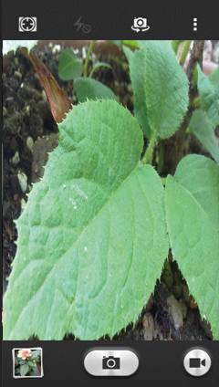

图1-3 情景模拟演示

基于以上的观察和背景，本作品综合利用图像处理基于图像的目标识别等技术，开发一个以判别植物种类为主体的，兼顾植物生活习性和培育技巧知识的普及，基于移动终端图像的植物叶片的自动识别系统。其主要目的可概括为以下几点：

1.  可以是使更多的人了解植物，从而提高人们对植物的保护意识。

2.  大大降低了普及植物知识所需的成本，在大多数人都至少拥有一台手机的时代背景下，通过本产品了解植物将会变得十分便捷。

3.  提供用户叶片查询的同时，即时的为用户推广一些基本的植物培育技巧，增强植物培育的兴趣。

4.  以用户的群体行为完成多种类植物叶片数据库的建设，为之后的科研和工作积累素材

**1.2 主要研究内容**

**1.2.1 国内外研究现状**

近年来，国内外众多学者在基于图像的植物叶片识别方面取得了一定的进展。在国外，鲁尔基电机工程学系（Singh
K，2010）采用基于二叉树结构的多支持向量机方法识别32种植物叶片。捷克技术大学（Sixta
T,2011）利用形状上下文内部距离进行叶片识别。

国内方面，北京林业大学（阐江明
等，2010）等将纹理特征运用到植物叶片识别中，实验证明纹理特征可作为植物叶片识别的特征之一[2]。同济大学机器学习与系统生物学实验室（黄双德，2013）完成了基于android的植物叶片识别系统[3]。

**1.2.2 项目研究目标**

>   1、验证多特征（形状、纹理、颜色）下基于植物叶片图像辨识植物叶片种类的可行性，对准确度的提升程度，同时确定各特征所占权值的多少。

>   2、设计并完成一种友好的、合理的交互方式、探索一种有效的基于用户群体性行为的植物叶片图像数据收集的方式。

**第二章 平台与开发工具**

**2.1 android studio 简介**

Android Studio 是一款由Google公司 提供的Android开发环境，于2013年Google
I/O大会发布。基于IntelliJ IDEA. 类似 Eclipse ADT，Android Studio 提供了集成的
Android
开发工具用于开发和调试。其功能强大的布局编辑器，极大的方便了控件的添加以及效果预览，同时支持Android专属的项目重构和快速修复。

**2.2 SlidingMenu简介**

SlidingMenu是一款开源的Android开发类库，它可以让开发者在自己的Android
App中非常便捷地创建侧滑菜单，由jfeinstein10设计完成。能方便的进行各种操作，如
Google+、QQ、知乎等诸多优秀应用都采用了这种界面方案。

**2.3 xUtils的简介**

xUtils
是一款涵盖众多实用android工具的开源框架。主要包含四大模块：DbUtils模块、ViewUtils模块、HttpUtils模块、BitmapUtils模块。本项目中主要采用了其.
HttpUtils模块用以完成图像的高速上传[5]。

**第三章 系统的总体分析和设计**

**3.1 系统概述**

“识叶”是一款利用基于图像的目标识别等技术，以判别植物种类为主体的，兼顾植物生活习性和培育技巧知识的普及的手机App。

该系统主要分为五个模块：系统登录&&注册模块、资讯模块、“识叶”模块、关于我们模块、帮助模块。

**3.2 系统的功能分析**

**3.2.1系统登录&&注册模块**

**启动动画部分:**用户应用图标，打开该软件后，启动动画持续三秒，跳入登录界面。

**用户登录部分:**在登录界面，输入用户名和密码，点击登录，系统将识别该用户的权限。

**用户注册部分:**用户进入登录界面后，点击“新用户”链接后，输入手机号，点击发送验证码，收到验证码后，输入验证码，点击下一步，进入注册界面，输入密码并确认密码后，点击“完成”按钮，完成注册。

**忘记密码部分:**
用户进入登陆界面后，点击“忘记密码”链接后，输入手机号，点击发送验证码，收到验证码后，输入验证码，点击下一步，进入修改密码界面，重新输入密码并确认密码后，点击“完成”按钮，完成密码的修改。

**主界面部分:**登陆后系统将跳转到主功能界面，左侧侧拉框将依次显示有：“主页”、“与我相关”、“帮助”、“设置”的功能键，默认主窗口显示有：“展示轮转框”，“资讯”、“识叶”等按钮。

**3.2.2 “资讯”模块**

点击主界面的“资讯”按钮后，进入“资讯”界面，点击相应的资讯分类（培训技巧，心情随笔，大家之作）按钮，了解该分类下的资讯内容简介，点击相应的简介内容，进入该条资讯的正文介绍部分，点击“刷新”按钮加载最新内容。

**3.2.3 “识叶”模块**

点击主界面“识叶”按钮之后，出现图片选择器，可以选择拍照或是选取图库中现有的图片，点击“确定”后，进行矩形裁剪，在点击“完成”后，返回识别后的结果(图片，名称，生活习性概述)。之后用户可以选择正确，错误，和模糊，以此来判定整个识别标准，同时帮助后台完成植物叶片图像的累积。

**3.2.4 关于我们模块**

点击主界面左侧功能栏“关于我们”按钮之后，出现团队介绍界面。

**3.2.5 帮助模块**

点击主界面左侧功能栏“帮助”按钮之后，出现帮助界面。

**3.3 系统的总体设计**

本系统大体分为两部分：客户端、服务器。用户能够方便快捷的在客户端上实现其操作要求，服务器则主要保存、整理用户资料，同时进行必要的逻辑运算，并根据用户的反馈和意见及时对网站进行维护和更新。

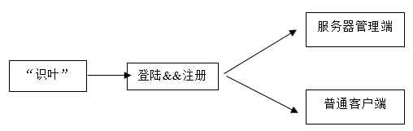

图3-1 总体设计

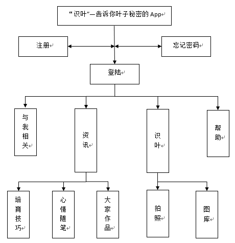

图3-2 系统功能结构图

本图详细的解释了系统所包含的主要功能：用户注册、用户登录、忘记密码、咨询、“识叶”等等功能，并以层次图的形式显示出来。

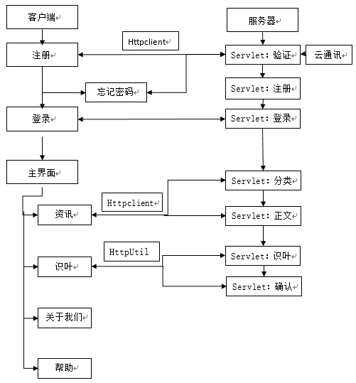

图3-3系统通信结构图

本图详细的表示了系统的主要通信模块及其所使用的通信框架：注册&&登陆模块使用httpclient类，以post方式传输，同时采取短信验证的方式确认用户的注册行为，使用云通讯平台。资讯模块同样使用httpclient类，以post方式传输。识叶模块则采用了xUtils框架中的httputil模块来完成图片的上传和消息的交换[6]。

图3-4客户端代码结构图

本图系统的的表示了客户端的代码结构:

fragment：存放SlidingMenu中主要用作界面呈现的Fragment；

mleaf：存放客户端中所有的Activity文件；

model：存放着客户端中的对象model；

service：存放Activity和Fragment文件中所有操作类文件，比如和服务器的通信；

util：存放着整个客户端所需要的工程类。

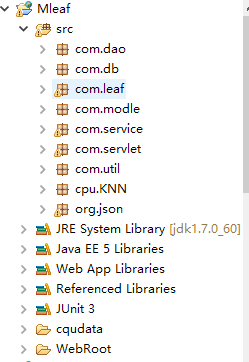

图3-5服务器代码结构图

本图系统的的表示了服务器的代码结构[7]:

db：存放服务器操作数据库的工具类；

leaf：存放着识叶模块中的形状特征提取，纹理特征提取，颜色特征提取文件；

service：存放必要的服务类文件，比如短信验证平台的调用；

util：存放着整个服务器所需要的工程类；

KNN：存放着KNN分类器做需要的文件；

cqudata:存放着识叶模块所需要的资源文件，比如植物生活习性的简介。

**第四章 系统的详细设计**

**4.1 登陆&&注册模块设计**

**4.1.1 客户端设计**

**设计布局：**

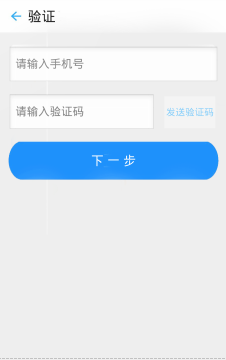

图4-1 登录界面 图4-2验证界面图 4-3注册界面

**结构分析：**本模块主要分为三部分,即登录部分、注册部分、忘记密码部分。其中注册部分和忘记密码部分又分为验证和注册（修改密码）两部分，注册部分和忘记密码部分，逻辑文件一致，仅在标题框有所变化，一个为“注册”，一个为“修改密码”。故本模块客户端部分，包括启动动画，逻辑代码共计七个文件：StartActivity、LoginActivity、LoginService、RegisterActivity、
RegisterService、VerifyActivity
、VerifyService。如下展示了LoginActivity和LoginService中的关键代码，可类比其他四个逻辑代码文件，基本结构相似。

**关键代码：**

**LoginaAtivity：**

**public void** ReadNet(String url,String user,String pass){  
  
**new** AsyncTask\<String,Void,String\>(){  
\@Override  
**protected** String doInBackground(String... params) {

//调用LoginService进行通信查询  
**return**

LoginService.*executeHttpPost*(params[0],params[1],params[2]);  
}  
**protected void** onPostExecute(String result){  
**if**(result.equals(**"true"**)){  
Toast.*makeText*(LoginActivity.**this**, **"登录成功"**,
Toast.*LENGTH\_LONG*).show();  
**dialog**.dismiss();

//验证成功后，跳转至主界面  
Intent main = **new** Intent(LoginActivity.**this**, MainActivity.**class**);  
startActivity(main);  
finish();  
}  
**else** {  
Toast.*makeText*(LoginActivity.**this**, **"登录失败"**,
Toast.*LENGTH\_LONG*).show();  
**dialog**.dismiss();  
}  
}  
}.execute(url,user,pass);  
}

**4.1.2 服务器设计**

**结构分析：**对应客户端部分，服务器主要分为三部分,即登录部分、注册部分、忘记密码部分。其中注册部分和忘记密码部分又分为验证和注册（修改密码）两部分，注册部分和忘记密码部分。因为验证部分不存在数据库操作，故主要逻辑代码共计六个文件：LoginServlet、LoginDAO、RegisterServlet、RegisterDAO、VerfityServlet、SendTemplateSMS，其中SendTemplateSMS为短信平台提供的API调用结构文件。如下展示了LoginServlet和LoginDAO中的关键代码，可类比其他三个逻辑代码文件，基本结构相似。

**关键代码：**

**LoginServlet：**

1)LoginDAO login = **new** LoginDAO();

2)**boolean** loged = login.login(username, password);

**LoginDAO：**// 验证处理

3)String logSql = "select \* from table\_password where username='" + username+
"' and password ='" + password + "'";// 获取SQL查询语句

**4.1.3 数据库设计**

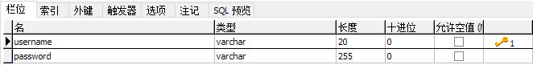

图4-4 登录模块数据库表

**4.2 “资讯”模块设计**

**4.2.1 客户端设计**

**设计布局：**

图4-5 “资讯”列表界面 图4-6 “资讯”正文界面

**结构分析：**本模块主要分为两部分,即“资讯”列表部分、“资讯”正文部分。其中列表部分主要有三大功能要求：加载最新、加载更多，点击进入正文。正文部分需要实现上下篇切换的功能要求，包括按钮切换和滑动切换。

**关键代码：**

**获得某分类下的新闻标题和概述：**

*//获取选中的新闻分类id*  
**1)mCid** = categories.get(position).get(**"category\_title"**).getCid();  
*//获取该栏目下新闻*  
**2)loadNewsAsyncTask** = **new** LoadNewsAsyncTask();  
**loadNewsAsyncTask**.execute(**mCid**,0,**true**);

**获得新闻详细信息：**

*/\* 获取新闻详细信息 \*/*  
**private** String getNewsBody()  
{  
String retStr = **"网络连接失败，请稍后再试"**;  
SyncHttp syncHttp = **new** SyncHttp();  
String url = **"http://111.114.116.141:8080/web/getNews"**;  
String params = **"nid="** + **mNid**;  
**try**  
{  
String retString = syncHttp.httpGet(url, params);  
JSONObject jsonObject = **new** JSONObject(retString);  
*// 获取返回码，0表示成功*  
**int** retCode = jsonObject.getInt(**"ret"**);  
**if** (0 == retCode)  
{JSONObject dataObject = jsonObject.getJSONObject(**"data"**);  
JSONObject newsObject = dataObject.getJSONObject(**"news"**);  
retStr = newsObject.getString(**"body"**);}  
} **catch** (Exception e)  
{e.printStackTrace();}  
**return** retStr;  
}

**4.2.2 服务器设计**

**结构分析：**对应客户端部分，服务器主要分为三部分,
,即“资讯”列表部分、“资讯”正文部分。在列表部分，当服务器接收到客户端发送的资讯的某分类标号后，根据标号，查找出数据库中该标号下的所有资讯列表，以json的数据格式返回给客户端，客户端接收并显示。同时当用户点击刷新按钮时，按照时间戳的进行筛选，将最新的资讯列表返回客户端，点击加载更多时，同理。当用户点击某标题时，客户端将该资讯的标号发送个服务器，服务器通过该标号，从数据库提取出该标号的资讯标题，来源，时间，正文等部分内容，同样以json的数据格式发送给客户端。而点击上下篇按钮时，即更改资讯标号，步骤相似。

**关键代码：**

//新建DAO层对象

1.  NewsDAO newsDAO = **new** NewsDAO();

//查询某分类下的资讯列表，返回count条数据

1.  retList = newsDAO.getSpecifyCategoryNews(cid, startNid, count)；

//封装数据

**3)for** (News news : retList)

{

HashMap\<String, Object\> map = **new** HashMap\<String, Object\>();

map.put("nid", news.getNid());

map.put("title", news.getTitle());

map.put("imgsrc", news.getImgSrc());

map.put("digest", news.getDigest());

map.put("source", news.getSource());

map.put("ptime", news.getPtime());

map.put("commentcount",commentCount);

list.add(map);

}

**4.2.3 数据库设计**

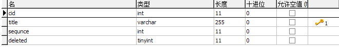

图4-7 “资讯”分类数据库表

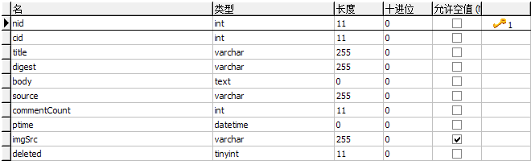

图4-8 “资讯”正文数据库表

**4.3 “识叶”模块设计**

**4.3.1 客户端设计**

**设计布局：**

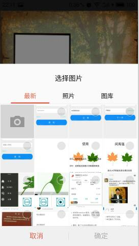

图4-9 图片选取界面 图4-10 图片裁剪界面 图4-11 结果显示界面

**结构分析：**本模块主要
围绕“识叶”部分展开。主要有四个步骤要求：选择图片、裁剪（压缩）图片，上传图片、显示结果。

图4-12 “识叶”客户端功能逻辑图

**关键代码：**

//调用系统相机和相册

1）Intent intent = **new** Intent(Intent.*ACTION\_PICK*, **null**);  
intent.setDataAndType(MediaStore.Images.Media.*EXTERNAL\_CONTENT\_URI*,  
**"image/\*"**);  
startActivityForResult(intent, *PHOTO\_PICK*);

//调用系统裁剪

2）Intent intent = **new** Intent(**"com.android.camera.action.CROP"**);  
intent.setDataAndType(uri, **"image/\*"**);

//调用xutils中的**httpUtils**完成图片上传

3）**httpUtils**.send(HttpRequest.HttpMethod.*POST*, **URL**, params, **new**
RequestCallBack\<String\>() {  
\@Override  
**public void** onFailure(HttpException e, String msg) {}  
\@Override  
**public void** onSuccess(ResponseInfo\<String\> responseInfo) {}  
}

**4.3.2 服务器设计**

**结构分析：**

图4-12 “识叶”服务器功能逻辑图

**4.3.2.1 图像预处理**

由于用户在拍摄过程中的任意性，所以获取到的图片极易受到环境因素的影响，存在一定的噪声影响，因此在进行形状特征提取和纹理特征提取之前必须对图片进行预处理，以保证识别的准确率。本系统使用高斯低通滤波器进行去噪，来获取平滑图像[8]。

图4-13高斯滤波函数

**关键代码：**

**for**(i = 1;i \< height - 1;i++)

{

**for**(j = 1;j \< width - 1;j++)

{

index = sum = 0;

**for**(**int** m = *i* - 1;m \< i + 2;m++)

{

**for**(**int** n = *j* - 1; n \< *j* + 2;n++)

{

*sum* +=*tmpdata*[m \* *width* + n] \**templates*[*index*++];

}

}

data[i \* width + j] = sum / 16;

}

*}*

**4.3.2.2 形状特征提取**

植物叶片的形状特征一直是辨识植物种类的重要特征之一，本系统中，形状特征包含有叶片近似宽比和七个Hu不变矩，共计8个变量[9-11]。

植物叶片近似宽比的获取主要分为三个步骤:

1）首先将预处理后的图片进行灰度变换，然后将其变换为二值图像；

2）通过
8-邻域轮廓跟踪算法对二值图像进行边界跟踪，同时记录下其叶片轮廓上的每一个边界像素的坐标。

3）定义近似叶片的长为竖直方向上的两点间欧式距离的最大值Wmax，宽为水平方向上两点间距离的最大值Hmax，则X1=Wmax
/ Hmax。

植物叶片图像七个Hu不变矩的获取方法:

1）在离散情况下，假设图像函数为

，那么图像的p+q阶几何矩（标准矩）定义为

2）归一化的中心距定义为：

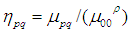

注：

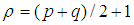

3）利用二阶和三阶归一化中心矩构造了7个不变矩：

**4.3.2.3 纹理特征提取**

从植物学的角度观察，植物叶片上的叶脉分布一直是植物学家辨识植物叶片种类的重要特征之一，那么呈现在图像中的叶脉分布也就具有了一定的纹理特征。因此本系统中，采用能够表达图像纹理特征的灰度共生矩阵来描述这一特征[12]。

**4.3.2.3 颜色特征提取**

由于植物在成长过程中会发生颜色的变化，因此颜色特征可以作为一个分辨植物种类的特征之一，本系统中，采用了颜色矩来表示这一特征。颜色矩的数学定义如下：

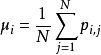

其中，

表示彩色图像第i个颜色通道分量中灰度为j的像素出现的概率，N表示图像中的像素个数。图像的三个分量R,G,B图像的前三阶颜色矩组成一个9维直方图向量[13]。

**4.3.2.4 分类器设计**

本系统中，选择KNN分类器来完成植物叶片特征数据的分类，K-近邻（K-Nearest
Neighbors,
KNN）是一种很好理解的分类算法，简单说来就是从训练样本中找出K个与其最相近的样本，然后看这K个样本中哪个类别的样本多，则待判定的值（或说抽样）就属于这个类别。

经过手动测试，即将K值依次设置为1-15时，测试系统准确率，发现当K值为3时，系统的准确率最高。

**4.4 帮助模块设计**

**4.4.1 客户端设计**

**设计布局：**

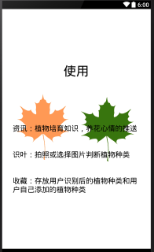

图4-12 帮助界面图

**4.5 关于我们模块设计**

**4.4.1 客户端设计**

**设计布局：**

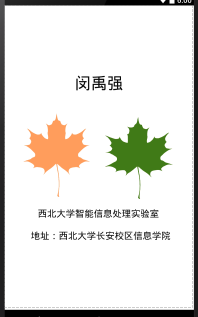

>   图4-13 关于我们界面图

**第五章 系统测试及运行结果**

**5.1 系统测试的目标**

系统测试是整个软件最后必须要经历的步骤，系统测试主要测试系统的稳定性、健壮性等。本章节主要测试各个界面显示、切换是否正常、功能逻辑是否实现，系统鲁棒性与否。

**5.2 测试条件**

鉴于系统是基于客户端-服务器模式，所以整个测试过程需要在联网的条件下进行，具体步骤如下：

1.  发布服务器程序到tomact；

2.  将Android应用的HttpClient访问地址设为本机的IP地址；

3.  让手机共享电脑的处于同一IP地址下，即打开360wifi，并确保手机已连接。（当然手机需要设置为调试模式）。

**5.3 测试流程**

**5.3.1登录 &&注册模块：**

**登录：**点击Mleaf图标，打开程序，经过3s的启动动画后，进入用户登录界面、输入用户名（手机号码）、用户密码之后，点击登录进入主界面。同时，在未输入手机号码的情况下，点击登录按钮，系统提示：“手机号码不能为空”。

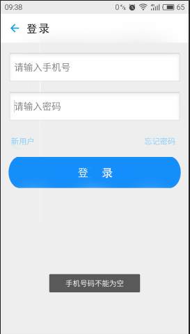

图5-1 启动界面 图5-2 登录成功界面 图5-3 登录提示界面

**注册：**进入用户登录界面、点击“新用户”进入验证界面，属于用户手机号码后，点击发送验证码，在出现“发送成功”的提示后，等待几秒后，将接收到的短信验证码输入，点击下一步进入注册界面，输入密码并确认后（密码不一致出现系统提示），出现“注册成功”提示。然后返回登录界面，进行登录操作即可。

图5-4 验证短信

图5-5 验证界面 图5-6 注册成功界面 图5-7 注册提示界面

**忘记密码：**进入用户登录界面、点击“忘记密码”，进入找回密码界面，输入用户手机号码后，点击发送验证码，在出现“发送成功”的提示后，等待几秒后，将接收到的短信验证码输入后，点击下一步进入修改密码界面，输入密码并确认后（密码不一致出现系统提示），出现“修改密码成功”提示，截图可参考图5-4，5-5，5-6。

**5.3.2“资讯”模块：**

登录成功后，进入主界面，左滑或点击左上角图标可呈现一个侧拉功能框。在主界面部分，点击“资讯”按钮，进入资讯列表界面，主要分为三大模块：培育技巧、美文随笔、大家作品。点击任意模块文字，出现该栏目下资讯列表。点击列表，进入资讯正文界面。

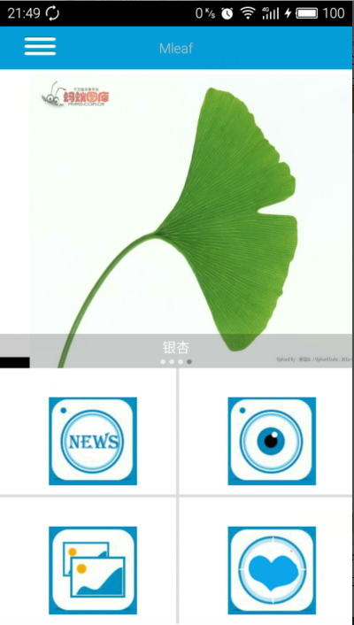

图5-8 测拉功能栏 图5-9 主界面

图5-10 验证界面 图5-11 注册成功界面 图5-12 注册提示界面

**5.3.3“识叶”模块：**

进入主界面，点击“识叶”图标，出现图片选择界面，可以选择拍照或者从图库中选择一种叶子的照片，点击确定后，进入裁剪界面，可通过拖动矩形框，实现对图片的裁剪，裁剪完成后，点击确定，进行自动识别，出现“正在识别的提示框”，等待几秒后，在结果界面显示识别结果。用户可通过界面底部的三个按钮来反馈识别结果，以决定服务器保存图片的格式，当用户点击后，会出现“评价成功”等系统提示。

图4-13 图片选取界面 图4-14 图片裁剪界面 图4-15 结果显示界面

**第六章 展望与总结**

**6.1 总结**

1）保持强大的学习能力：从一枚完全不懂的Android小白，到现在的日渐熟悉，我明白了保持强大学习能力的重要性，万事开头难，感谢老师们教会我一个良好的思维方式和较强的资讯能力。

2）不要盲目的开始：一个毛糙性子的我，总习惯在刚刚接到题目的时候就匆忙的开始，结果就是越做越多，越做越繁琐。所以在这次项目中，从画流程图开始，绘界面、选择开发工具、设计结构、难点技术的突破等等，都是尽可能的先完善前期的工作，不断的更正，直到整个项目流程在脑海里清晰的形成时，才开始编码工作，这样做的结果就是在整个的编码过程中，我很少卡顿，而且代码的可读性更高。

3）耐心、细致：毕业设计是一个对四年所学总结，是不断突破难点的过程，所以要求我们要足够坚持，不放弃。同时也要求我们在对待细节的问题上足够认真，来避免重复的犯错。

从理论到实践，整个开发的过程对我来说不仅仅是一次专业技能的提高；也是一次对自我性格的打磨，受益匪浅。

**6.2 展望**

时至今日，整个项目基本已经完成，工程也基本测试完毕，然而在整个开发过程中还有一些不足，列举如下：

>   1）单一的叶片识别功能，吸引力不足，之后可能会考虑加入花朵识别。

>   2）在“识叶”模块中的图像分割部分做的不够细致，仅使用了矩形裁剪框进行了一次粗分割，后期的设想是对图像进行一个canny算子的边缘检测后，先膨胀后腐蚀，以存在的边缘为主，结合手动参与，实现叶片图像的精准分割。

>   3）由于初期考虑到系统流量的原因，“资讯”模块的界面设计不够友好，仅文字的呈现方式太过单一。
